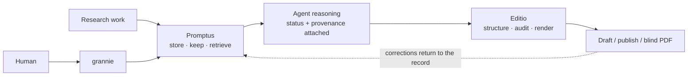

<div align="center">

# Organon

### Persistent research memory. Evidence-calibrated academic writing.

For Claude Code and Codex.

[](https://github.com/Gavin-Qiao/organon/actions/workflows/ci.yml)
[](https://github.com/Gavin-Qiao/organon/releases)
[](https://github.com/Gavin-Qiao/organon/releases)
[](https://bun.sh)
[](LICENSE)

[Promptus](promptus/README.md) · [Editio](editio/README.md) · [Upgrade guide](MIGRATION.md) · [Benchmarks](benchmarks/README.md) · [Contributing](CONTRIBUTING.md)

</div>

> [!NOTE]
> *Organon* means "instrument." Aristotle's *Organon* gathered tools for sound reasoning;
> this repository gathers two tools for sound research.

## The research loop

The failure modes this project is built around are painfully ordinary. A long-running agent
forgets why a decision was made, repeats a dead end, or writes a sentence more confidently than
its evidence allows. Organon keeps the chain visible from the first research note to the final PDF.



## Two plugins, one evidence chain

| | [Promptus](promptus/README.md) | [Editio](editio/README.md) |
| --- | --- | --- |
| **Use it when** | A project must survive many sessions, handoffs, and compactions | Stored research must become a defensible paper |
| **Source of truth** | Gated Markdown: Telos, ledger, findings, literature, memory | Per-section Markdown plus `paper.json` and `numbers.json` |
| **Core discipline** | Retrievable units carry stable identity and epistemic status; evidence-bearing units can bind sources and artifacts | Authors mark and grade claim spans; deterministic gates check grounds, numbers, venue rules, and build health |
| **Human surface** | `grannie` explains the store in plain language | Draft, publish, and blind paper renders |
| **Current scope** | Stable IDs, bounded lexical retrieval, artifacts, graph inspection, session preflight, trajectory review, thinker custody | Structure, LaTeX, figures, claim and number gates, workspace doctor, humanizer, and four venue profiles |

Editio tables, bibliography generation, reproducibility packaging, and rebuttal tooling remain
later phases. The README describes the code that ships, not the larger design horizon.

## Install

Organon supports Claude Code and Codex through adapters over the same plugin contents. The scripts
require [Bun](https://bun.sh) 1.3 or newer. Building an Editio paper also requires a TeX
distribution; `editio-latex` provides detect-first, platform-aware setup guidance.

### Claude Code

```text
/plugin marketplace add Gavin-Qiao/organon
/plugin install promptus@organon
/plugin install editio@organon
```

### Codex

```bash
codex plugin marketplace add Gavin-Qiao/organon
codex plugin add promptus@organon
codex plugin add editio@organon
```

Start a new Codex task after installation so it loads the new skill bundle. Promptus also ships
optional lifecycle hooks. Inspect their exact definitions with `/hooks` before trusting them;
every skill works without hook trust.

<details>
<summary><strong>Migrating from the former promptus-only marketplace</strong></summary>

The marketplace moved to `Gavin-Qiao/organon` and is now named `organon`.

```text
/plugin marketplace remove promptus
/plugin marketplace add Gavin-Qiao/organon
/plugin install promptus@organon
/plugin install editio@organon
```

The `humanizer` skill now ships with Editio. Promptus's `grannie` uses it when both plugins are
installed and falls back to plain-language answers when Editio is absent.

</details>

## What changes in daily work

- **Resume with evidence.** Actionable preflight diagnostics and source-backed evidence cards
  expose recorded support, replacements, and open work without deciding scientific truth.
- **Keep maintenance bounded.** Record a batch, then rebuild and check once. Lexical retrieval
  stays the default; persistent raw caching is off, and local semantic recall is optional.
- **Write from the current record.** Manuscript grounds retain canonical identity and lifecycle;
  historical claims report rejected evidence without turning it into positive support.
- **Adopt one project at a time.** Preview exact source, policy, and package fingerprints before
  a derived-only refresh. Installation never implies that a running research session has updated.

See the [upgrade guide](MIGRATION.md), [retrieval design](RETRIEVAL.md), and
[implementation verification](RELEASE-VERIFICATION.md). Release badges identify published
versions; the verification records describe their own tested scope, not live-project adoption.

## From research to paper

Initialize Promptus first:

```text
/promptus:promptus-init
```

In Codex, ask it to use the `promptus-init` skill. The workflow creates a project-local `.promptus/`
store and an `AGENTS.md` cadence. From there:

1. Use `research-ledger` while work happens. Decisions, results, failed routes, and sources enter
   through the gated writer rather than freehand Markdown edits.
2. Use `recall` before asserting what the project already knows. Retrieval is ranked, bounded, and
   status-aware.
3. Use `promptus-checkpoint` before compaction or a long handoff. It flushes perishable results,
   refreshes the NOW header, and rebuilds the derived index.
4. When the evidence is ready, run `/editio arxiv` in Claude Code or ask Codex to start an arXiv
   paper with the `editio` skill.

Draft displays the grade and grounds of each marked claim span. Publish removes the annotations;
blind also masks identity.

## Design constraints

The current integration adds preview-first project adoption, bounded raw-parse caching,
actionable resume diagnostics, and source-backed evidence navigation. See the
[release integration plan](RELEASE-PLAN.md) and [Promptus operations guide](promptus/README.md#runtime-resource-controls-and-project-adoption).
These are checkout capabilities, not a claim that installed plugins or live projects have updated.

> [!IMPORTANT]
> Markdown is the only source of truth. Derived indexes and generated TeX are disposable. Source
> writes go through deterministic gates. New machinery is adopted only after a measured threshold
> justifies it.

The LLM keeps the jobs that need judgment: prose, relevance, synthesis, and deciding what matters.
Scripts own timestamps, stable IDs, placement, indexing, relation resolution, artifact hashes,
claim gates, and render mechanics. This keeps model judgment small and makes mechanical drift
testable.

## Measured, not presumed

The [benchmark notebook](benchmarks/README.md) records continuity, maintenance, retrieval, and
machinery-threshold experiments with their controls and exact receipts. The isolated continuity
suite is synthetic; it validates the harness and Promptus mechanics, not behavior on Psi, MoT,
Probatio, or Mensura.

Organon keeps its own research memory in [`.promptus/`](.promptus/) and develops both plugins from
failures observed in real long-running projects.

## Repository map

```text
organon/
├─ .claude-plugin/marketplace.json    Claude Code marketplace
├─ .agents/plugins/marketplace.json   Codex marketplace
├─ promptus/                          research memory plugin
├─ editio/                            academic writing plugin
├─ benchmarks/                        experiments, controls, and exact receipts
└─ .promptus/                         Organon's own dogfood research store
```

## Development and releases

```bash
bun run validate   # marketplace and both plugin adapters
bun run health     # authoritative Organon store gate
bun test           # complete repository suite
bun run check      # all three
```

The adapter contract and test suite run on Ubuntu, Windows, and macOS. Codex hooks provide separate
POSIX and Windows launch commands.

Commits and pull requests use scoped Conventional titles: `type(scope): subject`. Read
[`AGENTS.md`](AGENTS.md) for the working cadence, [`CONTRIBUTING.md`](CONTRIBUTING.md) for project
conventions, and [`RELEASING.md`](RELEASING.md) for the per-plugin release process. Releases use
independent tags: `promptus-vX.Y.Z` and `editio-vX.Y.Z`.

## License

Organon is GPL-3.0-only, © 2026 Mohan Qiao. See [`LICENSE`](LICENSE). Editio's `humanizer` is an
extended fork of [blader/humanizer](https://github.com/blader/humanizer); the upstream MIT notice
is preserved in [`editio/NOTICE`](editio/NOTICE).
