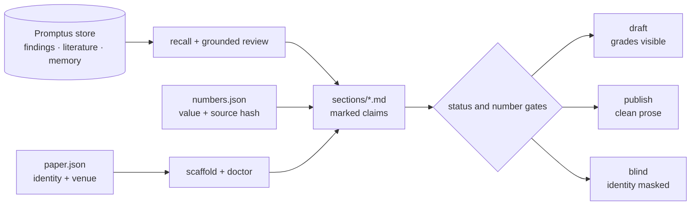

<div align="center">

# Editio

### Evidence-calibrated academic writing.

Per-section Markdown, checked claims and numbers, three render modes.

[](https://github.com/Gavin-Qiao/organon/actions/workflows/ci.yml)
[](https://github.com/Gavin-Qiao/organon/releases)
[](../promptus/README.md)
[](../LICENSE)

[Quick start](#quick-start) · [Audit loop](#the-audit-loop) · [Toolchain](#what-ships) · [Venues](#venue-profiles) · [Organon](../README.md)

</div>

Editio is Organon's academic-writing toolchain for Claude Code and Codex. It reads a
[Promptus](../promptus/README.md) store for grounding and writes a project-local `.editio/paper/`
workspace. Markdown remains the paper's authored source; TeX and PDFs are derived build products.

> [!IMPORTANT]
> Agents or authors assign claim grades. Editio does not pretend that judgment is mechanical.
> `editio-status` performs the mechanical half: resolve grounds, compare their status with the
> asserted grade, and fail unsupported spans unless the author records an explicit override where
> the contract permits one.

## From evidence to paper



## Quick start

Promptus is a prerequisite because it supplies the evidence store.

### Claude Code

```text
/plugin marketplace add Gavin-Qiao/organon
/plugin install promptus@organon
/plugin install editio@organon
```

In a repository with `.promptus/`:

```text
/editio arxiv
```

### Codex

```bash
codex plugin marketplace add Gavin-Qiao/organon
codex plugin add promptus@organon
codex plugin add editio@organon
```

Then ask Codex to use the `editio` skill to start an arXiv paper.

Editio requires a TeX distribution at build time. The `editio-latex` skill detects the local
environment first and gives platform-aware setup guidance; Editio does not vendor TeX.

## Mark claims where they live

Claims stay inside the prose rather than in a parallel database:

```markdown
[The controlled run reproduced the effect.]{.claim .validated grounds=finding-run-42}

[The effect may generalize to a second population.]{.claim .conjectured grounds=finding-run-42}

[The mechanism is still unknown.]{.claim .unsourced}
```

The draft render makes those distinctions visible. The publish render removes claim annotations;
the blind render also masks identity and self-citations.

| Mode | Purpose | Output behavior |
| --- | --- | --- |
| `draft` | Thinking and internal review | Shows claim grades, grounds, TODOs, and provenance stamps |
| `publish` | Clean external render | Removes Editio annotations while retaining authored content |
| `blind` | Anonymous review | Uses publish behavior, masks authorship and self-citations, and drops content marked to be hidden in blind mode |

Claim grades do not block rendering. Malformed source or an invalid workspace still can. The
publication gate is separate so authors can think in an imperfect draft without confusing that
draft for a defensible submission.

## The audit loop

1. Write the argument in `sections/*.md`; mark checkable spans with `{.claim}`.
2. Use Promptus `recall` to retrieve relevant evidence with its status attached.
3. Run `grounded-writing-reviewer`. It reports unsupported, over-confident, or under-confident
   spans without editing the source.
4. Assign the grade and grounds in Markdown. If an author accepts an unsourced claim or an
   overclaim, add `override="reason"` so the exception remains explicit.
5. Render, inspect, and run the gates.

```bash
bun editio/scripts/editio-status.ts --claims
bun editio/scripts/editio-numbers.ts --gate
bun editio/scripts/editio-status.ts --gate
```

`editio-status --gate` requires:

- no ungraded claim spans;
- no unsourced claim without a recorded override;
- no validated claim resting on weak, unknown, absent, or invalidated grounds without a recorded
  override.
- no conjectured claim resting on invalidated or unknown grounds; overrides do not apply here;
- no conflicting grades or historical report without resolvable closed evidence.

An override is not silent success. The report prints the reason and preserves the author's
responsibility on the record.

Use stable Promptus IDs for durable grounds; legacy slugs and unique aliases remain supported.
Editio now reads effective lifecycle through Promptus's canonical parser, including supersession
and memory retirement, rather than interpreting raw frontmatter independently. This is a checked
packaged copy, not a runtime dependency on a sibling plugin or a potentially stale cache.
Explicit manuscript grounds also resolve archived pages and ledger entries. Moving evidence
to an archive does not change its status or erase its lifecycle relations; invalidated evidence
still cannot become positive support.

An explicitly attributed account of a rejected, superseded, or retired record uses
`[The log records why the route was rejected.]{.claim .historical grounds=<id>}`.
This is not a validated positive claim. Draft rendering uses grey text and a historical grounds
label; the gate prints the source's closed status and rejects unknown/untrusted grounds, mixed
grades, and overrides. The reviewer must still check that the prose reports history rather than
endorsing the rejected proposition. Metadata checks cannot prove semantic entailment.

Maintainers edit the reader only under `promptus/scripts/lib/`, then run
`bun promptus/scripts/sync-reader.ts --write`. Plugin validation checks the packaged copy for
drift. Existing manuscripts and older minimal stores need no rewrite; new historical annotations
require the new reader and remain ungraded under older Editio gates.

## One authored paper, several derived views

For a single-section authoring preview, `editio-latex` supplies a wrapper that loads the same
bound numbers, shared macros and identity definitions. Its article-class preview is not a
substitute for the venue-specific final build.

```text
.editio/paper/
├─ paper.json                 title, authors, venue, section order
├─ numbers.json               load-bearing values and source files
├─ sections/*.md              authored paper
├─ figures/                   source figures + venue-sized style
├─ front/
│  ├─ macros.tex              authored extension point
│  ├─ identity.tex            generated from paper.json
│  └─ numbers.tex             generated from numbers.json
├─ main.tex                   generated assembly
├─ editio.sty                 generated three-mode layer
├─ build/main.pdf             canonical draft build
├─ build-publish/main.pdf     canonical publish build
└─ build-blind/main.pdf       canonical blind build
```

Generated files are disposable. Authored files survive scaffold reruns; `--force` refreshes only
the generated contract and the doctor withholds unsafe regeneration advice when workspace order or
metadata has diverged.

`paper.json` is the single source for title and identity. `editio-identity` generates data macros
for the title, authors, correspondence, keywords, running heads, and bios. The doctor flags hard
coded copies that could drift or leak into a blind build.

`numbers.json` plays the same role for results. Every handle names a value and may also name source
files and the computation that produced it. `editio-numbers --write` produces `front/numbers.tex`
and locks the source hashes of sourced, unpinned values. The gate rejects stale, unknown,
malformed, or hand-edited bindings; an explicitly pinned value passes on the record.

## What ships

| Layer | Surface | What it owns |
| --- | --- | --- |
| Orchestration | `/editio`, `editio` | Start or resume a paper and continue the requested writing, rendering, or audit work |
| Argument | `editio-structure` | DoCO/DEO section orders, contribution-first framing, abstracts, and exemplar-derived craft |
| TeX | `editio-latex`, `editio-scaffold`, `editio-render` | Environment guidance, idempotent workspace generation, Markdown-to-TeX contract, three modes |
| Evidence | `grounded-writing-reviewer`, `editio-status` | Read-only prose audit, grounds resolution, drafted-word counts, publication gate |
| Numbers | `editio-numbers` | One value per handle, source-hash lock, generated bindings, stale-number gate |
| Figures | `editio-figures`, `editio-figcheck` | Claim-first figure craft, venue sizing, caption discipline, exact PDF-width check |
| Identity | `editio-identity` | Data macros from `paper.json`, bios, blind-safe author surfaces |
| Health | `editio-doctor` | Scaffold, venue, order, source, identity, path, VCS, asset, and budget diagnostics |
| Voice | `humanizer` | AI-tell removal plus positive human-writing patterns; pure style, no store mutation |

The renderer is deliberately small and tested against a golden contract in
[`templates/contract/`](templates/contract/). A future Pandoc or other replacement must preserve
that authoring subset rather than silently changing what the Markdown means.

## Venue profiles

Venue rules are data under [`templates/venues/`](templates/venues/), not branches scattered through
the scripts.

| Profile | Contract encoded today |
| --- | --- |
| `arxiv` | One-column preprint, 165.1 mm figure slot, `article` + `natbib` reference scaffold |
| `tpami` | IEEEtran Computer Society journal mode, two-column float discipline, running heads, bios, page-budget diagnostics |
| `nmi` | Nature Machine Intelligence Article order, source/display budgets, optional blind mode, 88/180 mm final-artwork slots; generated layout is an initial-review proxy, not Nature house style |
| `neurips` | Official annual kit mapping for draft/blind/publish, content-page and PDF-size checks, required checklist and style-file verification |

Year-specific official kits remain operator-supplied. Editio verifies the declared assets but does
not redistribute them. For example, the NeurIPS profile requires the official style and checklist
in the paper workspace. The NMI profile records initial-submission and final-artwork rules without
claiming to reproduce Nature's production layout.

## Build and handoff

From an Organon checkout, point the renderer at the paper project:

```bash
bun editio/scripts/editio-render.ts --root /path/to/project --all
```

Then build from `/path/to/project/.editio/paper/`:

```bash
latexmk main.tex
latexmk -usepretex='\def\editiomode{publish}' -outdir=build-publish main.tex
```

Installed agents resolve the script from their plugin root through the skills. Canonical PDFs stay
inside the build directories. The source root should remain PDF-free; `editio-doctor` flags stray
copies that can masquerade as the current paper. Put durable handoff snapshots in a dated
`archive/` path, commit the authored paper directory, and let Git provide version history.

The adapter contract and test suite run on Ubuntu, Windows, and macOS. Editio ships its own
templates and `editio.sty`; it does not vendor a TeX distribution, plotting stack, or official
year-specific venue kit.

## Deliberately not shipped yet

> [!NOTE]
> Table generation, bibliography generation from the Promptus literature store, reproducibility
> packaging, generalized venue packaging, rebuttal tooling, and broader structure/notation linting
> remain later phases. Current READMEs describe implemented code, not roadmap intent.

The next planned unit is `editio-tables`, driven by a real paper need. Later work remains subject to
the same rule as the rest of Organon: a concrete failure first, then the smallest reusable tool.

## Research foundations

<details>
<summary><strong>Structure and writing craft</strong></summary>

- Mensh B, Kording K (2017). [Ten simple rules for structuring papers](https://doi.org/10.1371/journal.pcbi.1005619).
- Gopen GD, Swan JA (1990). *The Science of Scientific Writing*.
- Whitesides GM (2004). [Whitesides' Group: Writing a Paper](https://doi.org/10.1002/adma.200400767).
- Nature Portfolio. [Formatting guide](https://www.nature.com/nature/for-authors/formatting-guide).
- Constantin A, Peroni S, Pettifer S, Shotton D, Vitali F (2016).
  [The Document Components Ontology](https://doi.org/10.3233/SW-150177), with the companion
  [Discourse Elements Ontology](http://purl.org/spar/deo).

The `editio-structure` skill's cited distillation and paper exemplars live in
[`skills/editio-structure/references/`](skills/editio-structure/references/).

</details>

<details>
<summary><strong>Figure craft</strong></summary>

- Rougier NP, Droettboom M, Bourne PE (2014).
  [Ten Simple Rules for Better Figures](https://doi.org/10.1371/journal.pcbi.1003833).
- Cleveland WS, McGill R (1984). [Graphical Perception](https://doi.org/10.1080/01621459.1984.10478080).
- Okabe M, Ito K. [Color Universal Design](https://jfly.uni-koeln.de/color/).
- Nuñez JR, Anderton CR, Renslow RS (2018). [The cividis colormap](https://doi.org/10.1371/journal.pone.0199239).
- Krzywinski M, Altman N (2013). [Error bars](https://doi.org/10.1038/nmeth.2659).
- Wilke CO (2019). [Fundamentals of Data Visualization](https://clauswilke.com/dataviz/).
- Financial Times. [Visual Vocabulary](https://github.com/Financial-Times/chart-doctor/tree/main/visual-vocabulary).

The complete cited craft notes live in
[`skills/editio-figures/references/`](skills/editio-figures/references/).

</details>

<details>
<summary><strong>Reproducible numbers and upstream code</strong></summary>

`editio-numbers` draws on Claerbout and Karrenbach's reproducible-research account, Sweave,
knitr, and Sandve et al.'s rules for computational research. The cited notes live in
[`skills/editio-numbers/references/`](skills/editio-numbers/references/).

The `humanizer` skill is an extended fork of
[blader/humanizer](https://github.com/blader/humanizer), © 2025 Siqi Chen, MIT. Its notice is
preserved in [`NOTICE`](NOTICE).

</details>

## Development

```bash
bun test editio/scripts/test
bun run validate
```

Read [`CHANGELOG.md`](CHANGELOG.md) for release history and [`RELEASING.md`](../RELEASING.md) for
the per-plugin release process.

## License

Editio is GPL-3.0-only, © 2026 Mohan Qiao. See [`LICENSE`](../LICENSE). The `humanizer` fork retains
its upstream MIT notice in [`NOTICE`](NOTICE).
