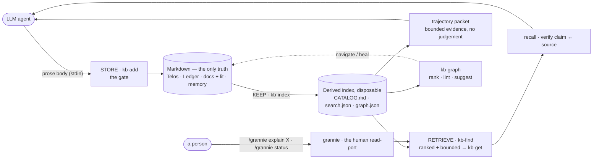
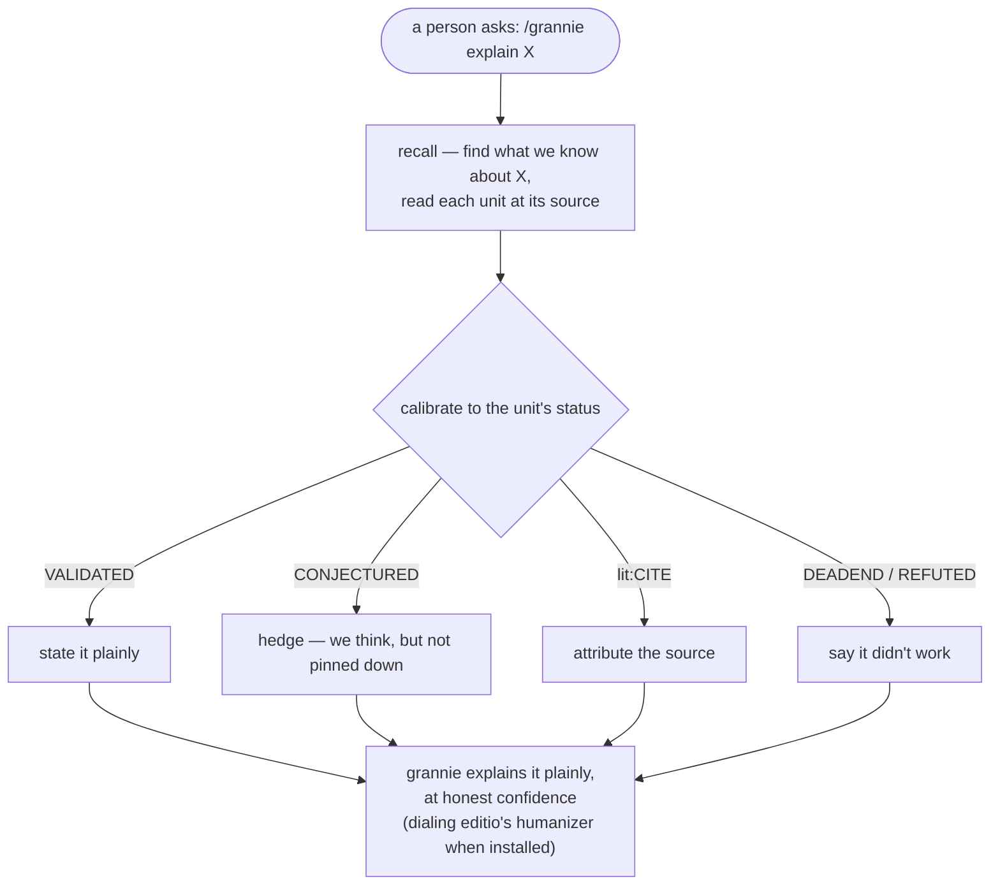

<div align="center">

# Promptus

**Store what your research knows. Retrieve it with its confidence attached. Write only what you can defend.**

[](https://github.com/Gavin-Qiao/organon/actions/workflows/ci.yml)
[](https://github.com/Gavin-Qiao/organon/releases)
[](../LICENSE)
[](https://bun.sh)

Part of [**Organon**](../README.md), beside [**editio**](../editio/README.md) — the writing toolchain that publishes from this store.

</div>

A file-based research knowledge system for Claude Code and Codex — a knowledge **substrate for the LLM agent**
doing the research. Promptus **stores / keeps / retrieves** everything a project knows — events (the
ledger, right and wrong), external literature, distilled findings, durable memory — as gated,
well-formed markdown, so the agent's reasoning and writing stay grounded and honest. A human reads in
through one port: **grannie**, which explains any stored concept in plain language at honest confidence.

> Latin *promptus* — "brought forth, ready, at hand": the store from which knowledge is brought
> out and made ready — to write, to recall, to hand off.

## Design philosophy

One bet underwrites the whole system: **the same virtues that make prose *human* make research
*trustworthy*** — calibrate to the evidence, name your sources, keep your dead-ends. Five
principles follow.

1. **Markdown is the only source of truth.** Everything a project knows is plain, readable
   markdown you could open with no tools at all. The derived index (`.promptus/cache/`) is *disposable*
   — rebuilt on demand, never authored. Lose it and nothing is lost.

2. **Every write goes through a gate.** Knowledge enters through one script, never freehand. The
   script owns the envelope, the timestamp, the id, the placement, and a controlled vocabulary —
   so format *can't* drift, because nothing is hand-typed. Friction is what makes a lab notebook
   rot; the gate removes it.

3. **Every unit carries its epistemic status.** A claim is tagged with where it stands —
   `CONJECTURED`, `VALIDATED`, `REFUTED`, a `DEADEND`. Retrieval hands back facts *with their
   confidence attached*, so what you write calibrates to what you actually know. This is the hinge
   between honest prose and honest research.

4. **A lexical unit beats a vector — at this scale.** For a small, dense, status-tagged corpus a
   status-bearing lexical unit is a better retrieval key than an embedding, and the `[[wikilinks]]`
   already *are* the graph. Promptus derives a bounded BM25-style lexical index, but still has no
   embeddings and no database. The heavy machinery turns on
   only past a threshold you have **measured** — never on spec.

5. **Prefer a script over a server.** The mechanics are a handful of TypeScript files on bun,
   stdlib-first. Nothing to host, nothing to vendor, nothing to keep running.

> **The invariant** — markdown is the only source of truth · the index is derived & disposable ·
> writes go through a gated script, never freehand · prefer a script over a server · add machinery
> (embeddings, a DB) only past a threshold you've **measured**.

*Kindred to Andrej Karpathy's [llm-wiki](https://gist.github.com/karpathy/442a6bf555914893e9891c11519de94f)
pattern — persistent, LLM-maintained markdown over raw sources, instead of re-retrieving on every
query. Promptus makes the append-only **ledger** the spine and adds a gate, epistemic status, and
renderers.*

## Install & quick start

Claude Code:

```
/plugin marketplace add Gavin-Qiao/organon
/plugin install promptus@organon
```

…or from the CLI: `claude plugin marketplace add Gavin-Qiao/organon` then
`claude plugin install promptus@organon`.

Codex:

```bash
codex plugin marketplace add Gavin-Qiao/organon
codex plugin add promptus@organon
```

Start a new Codex task, then inspect and trust the optional lifecycle hooks with `/hooks`.
Installing either adapter brings the same `scripts/`, skills, commands/workflows, and templates;
skills resolve the installed plugin root from their own `SKILL.md` location — nothing to copy in.
**Requires** [bun](https://bun.sh) ≥ 1.3 (the scripts are TypeScript on bun).

Stand up the four stores in a repo with `/promptus:promptus-init` in Claude Code, or ask Codex
to use the `promptus-init` skill:

```
/promptus:promptus-init
```

Then just work — tell the agent what happened, and the `research-ledger` skill records it through the
gate. The three verbs, under the hood:

```bash
# STORE — body on stdin; the script owns the timestamp, id, placement, and the gate
echo "Chose bun so bun:sqlite is a one-line upgrade later." \
  | bun promptus/scripts/kb-add.ts --substrate ledger --kind DECISION --status VALIDATED --title "Chose bun"

# KEEP — rebuild the derived card-catalog + lexical index + link graph
bun promptus/scripts/kb-index.ts

# PREFLIGHT — read-only; fail closed before a session trusts NOW or the cache
bun promptus/scripts/promptus-session-doctor.ts

# RETRIEVE — ranked and bounded (20 by default), every hit tagged substrate:status
bun promptus/scripts/kb-find.ts "bun"

# REVIEW — read-only bounded trajectory packet; judgement stays with the agent
bun promptus/scripts/promptus-trajectory-review.ts --scope project --max-units 200 --json

# ORIENT — exact north star, NOW, blocker, next action, and resume point
bun promptus/scripts/promptus-status.ts
```

(Those paths are from the Organon repo root; an installed skill resolves the plugin from its own
location.) Before compaction, use the `promptus-checkpoint` skill (`/promptus:checkpoint` in Claude
Code) to flush anything unrecorded. The `promptus` skill is the portable map
(`/promptus:help` in Claude Code).

## Architecture — four stores · three verbs · one human read-port



**Four stores** (per project), each unit tagged `substrate:status`:

| store | path | example tag |
|---|---|---|
| Telos | `.promptus/TELOS.md` | — (direction) |
| Ledger | `.promptus/ledger/RESEARCH-LEDGER.md` | `ledger:DEADEND` |
| Knowledge | `.promptus/docs/` (findings) + `.promptus/docs/lit/` (literature) | `finding:VALIDATED`, `lit:CITE` |
| Memory | `.promptus/memory/` (one file per fact) | `memory:validated` |

**Three verbs** — the mechanics are scripts, the reasoning is skills:

- **STORE** → `scripts/kb-add.ts`, the gated writer-jig. The LLM supplies only the prose body
  (stdin); the script owns the envelope, the local timestamp, the id, the placement, the index,
  typed relations, and the **hybrid gate** — *strict* for the curated library (finding/lit/memory:
  off-vocab input is refused with the allowed set), *permissive* for the lab-notebook ledger (an
  off-vocab kind/status is warned about but still written). Concurrent `kb-add` and `kb-now`
  processes serialize through a short project-local lease and atomically replace source files;
  same-second ledger ID and anchor collisions receive deterministic suffixes rather than
  overwriting or making an event ambiguous.
  Explicit ledger `--links` are stored in Markdown and survive an authoritative reindex.
  Memory relations use the same frontmatter contract as finding/literature pages; lifecycle
  inversions are substrate-aware (`SUPERSEDED` for ledger/page history, `retired` for memory),
  exist only in the derived projection, and fail closed if the vocabulary requests an illegal
  target status. After a successful write, human output includes a runnable installed-plugin
  `kb-index --root …` command; `--json` exposes the same operation as `next_action` for agents.
  `scripts/kb-amend.ts` is the matching
  gate for metadata transitions on an existing curated unit: it preserves the body, validates the
  requested state, and mints a missing stable ID. `kb-export` emits the relation graph as CiTO/PROV-O JSON-LD.
  Operator-approved trajectory reviews use the same gate as immutable `finding:REVIEW` pages;
  their scope, exclusive `since`, inclusive `through`, source fingerprint, and same-scope predecessor
  are machine-readable and revalidated inside the store lock.
- **KEEP** → `scripts/kb-index.ts` (rebuild the derived `.promptus/cache/CATALOG.md`,
  `search.json`, and `graph.json`; resolve stable IDs/slugs/aliases and supersession; keep archived
  ledger units as opt-in cold history), `scripts/kb-graph.ts lint`
  (graph health: dangling `[[handles]]` with a "did you mean?", plus units with neither a resolved
  wikilink nor a resolved typed relation),
  `scripts/promptus-check.ts --strict` (authoritative integrity, NOW, artifact, thinker-custody, and freshness gate;
  active artifact failures are red while superseded- or retired-unit drift is an archival warning;
  `--ratchet` enforces no new inherited debt), + `/promptus:checkpoint`. `promptus-doctor check
  --strict` independently binds `health.json` to the current source hash, source-file count, and
  live catalog count, and refuses stale or internally failed receipts with a direct
  `promptus-check` recovery instruction; inherited graph/digest/extra-tree debt stays report-only.
- **PREFLIGHT** → `scripts/promptus-session-doctor.ts` is the strictly read-only gate a session
  agent runs before trusting a long-running project's NOW or cache. It compares every live source
  unit with catalog/search and every archived unit with cold search, detects ambiguous identities and search keys, distinguishes stale
  receipts from current evidence, separates current artifact failures from superseded or retired archival
  warnings, and diagnoses graph, alias, ratchet, artifact, and layout debt.
  It never reindexes, repairs, refreshes, or baselines.
- **RETRIEVE** → two tiers. `scripts/kb-find.ts` ranks the lexical index, caps output at 20,
  optionally walks the `[[link]]` graph, and opens cold history only with `--history`; it says
  *which* units. `scripts/kb-get.ts` then returns one bounded body — one ledger entry's slice,
  never an accidental whole-log dump. The `recall` skill drives
  both (decompose → retrieve → confidence-gate → verify → synthesize). `scripts/kb-graph.ts` navigates
  the graph itself: `rank` (PageRank — the load-bearing units) and `suggest` (latent links —
  related-but-unlinked pairs to connect, by shared vocabulary + shared source).
  `scripts/promptus-trajectory-review.ts` is another bounded retrieval surface: after the existing
  session preflight, it selects a whole-project range or the inbound causal closure of one exact
  stable-ID endeavour root, preserves positive and negative dispositions, supplies causal context,
  and fails rather than guessing a prior review or truncating an oversized packet. The
  `trajectory-review` skill then fetches every body it uses and makes the retrospective judgement.

## Bounded trajectory reviews

Long-running research can keep excellent records and still circle locally. The trajectory-review
workflow helps an agent reflect on recorded evidence; it does **not** determine research quality or
choose project direction. Collection is deterministic, status-aware, source-fingerprint-bound, and
read-only:

```bash
# Whole-project range (fails with a narrowing request above the bound)
bun promptus/scripts/promptus-trajectory-review.ts --scope project --max-units 200 --json

# One endeavour: exact stable-ID root, exclusive since, inclusive through
bun promptus/scripts/promptus-trajectory-review.ts \
  --scope finding-20260101T000000Z-example-root \
  --since event-20260201T120000Z-prior-boundary \
  --through finding-20260301T120000Z-current-boundary --json
```

With no `--since`, continuation uses only the unique tail `REVIEW` for that exact scope. Reviews of
other interleaved endeavours do not move the boundary. The packet carries chronological headers,
effective and source status, typed relations, causal context, positive/negative navigation groups,
possible stopped-route challenges, bounded Telos/NOW orientation, and explicit unresolved issues—no
unit bodies and no quality score. The skill retrieves every body it actually cites and separates
store-backed fact from retrospective inference.

Persisting remains a second, explicit act. On operator instruction, the skill sends its body through
`kb-add --substrate finding --kind REVIEW` with the packet's `review_scope`, `review_since`,
`review_through`, and `review_source_fingerprint`; a successor carries `extends:<prior-review-id>`.
The write gate refuses stale fingerprints, unhealthy receipts, invalid boundaries, ambiguous chains,
or a missing predecessor relation. Park/main-spine/retire labels stay prose judgements and never amend
the reviewed units. Existing stores can collect packets without migration; persisting a review needs
the template vocabulary's `REVIEW` kind, added by the normal dry-run-first
`promptus-doctor upgrade --apply` merge while preserving project-specific terms and all unit bodies.

**The human read-port.** The agent operates the verbs above; a human reads in through **`grannie`** —
`/grannie explain <concept>` retrieves from the store and answers in plain language, grounded and
honest about confidence (a `CONJECTURED` claim is hedged, a `DEADEND` named). `/grannie status`
first reads `promptus-status`, then translates the exact north star, current state, blocker, next
action, and resume point. This is the one human-initiated loop. Two more skills support the agent's
*own* writing — not a separate audience:

- `humanizer` — the **style toolkit** (de-AI, human-voice patterns), now shipped by the **editio**
  plugin in this marketplace: grannie dials it to maximum accessibility when editio is installed,
  and degrades to plain answers otherwise. Pure style; it never touches the store.
- `recall` + the **`grounded-writing-reviewer`** agent — the **agent-side grounding audit**: retrieve a
  draft's claims, check each against its source, flag anything unsourced or louder than its status allows.

Every hit carries its status, so an answer is *calibrated to what we actually know* — the hinge
between honest prose and honest research. It shows most plainly at the human read-port, **grannie**:



## External thinker rounds

When local reasoning reaches one sharply stated theoretical bottleneck, the `thinker-round` skill
can prepare a self-contained prompt for a stateless outside reasoner. The thinker gets no workspace,
tools, network, session history, or prior-round memory. The operator carries the sealed prompt out
and returns the answer; Promptus never claims to contact the thinker itself.

The useful loop is intentionally short:

`retrieve first → one bounded question → freeze refute-first checks → preserve exact return → lit:UNTRUSTED → independently checked finding`

`thinker-round.ts` handles only custody: scaffolding, sealing hashes, exact-byte retention,
wrong-round/prompt-echo/duplicate detection, and quarantine through `kb-ingest`. The main agent does
the intellectual work: construct the question, reconstruct the answer, try to break it, and write a
normal `finding` linked by `derives-from` only for what survives. The raw answer never promotes
itself, and a round grants no implementation, experiment, publication, commit, or release authority.
Long valid round IDs receive bounded collision-resistant quarantine names, while already-bound
historical paths remain authoritative when their response and wrapper hashes still agree.

Use it for a proof, counterexample, exact bound, missing lemma, or similarly load-bearing theory
question—not for brainstorming, code review, source research, or any task that needs the workspace.

## The papers-scale crossing

The *scriptable* graph layer already ships at notes-scale, no embeddings: `kb-graph rank` is
personalized-PageRank over the `[[link]]` graph, `kb-graph suggest` a lexical latent-link linter
(shared vocabulary + shared source). What still defers is the **embedding-scale** version. When the
corpus becomes hundreds–thousands of *papers* (not one project's notes), the header catalog stops
fitting one read and that machinery turns on — each past a measured threshold, into the existing
seams: schema-constrained ingestion → embeddings as a pre-filter scoped to `.promptus/docs/lit` →
embedding-based latent links and community summaries over the literature → recursive summary tiers.
The invariant still governs. The full roadmap and the prior-art audit are in
[`.promptus/docs/report.md`](../.promptus/docs/report.md) and
[`.promptus/docs/promptus-vs-kag-coverage.md`](../.promptus/docs/promptus-vs-kag-coverage.md).

## Commands & skills

Claude Code exposes these command adapters; Codex uses the corresponding skills below.

| command | what it does |
|---|---|
| `/promptus:help` | the map — stores, verbs, and where to start |
| `/promptus:promptus-init` | scaffold the four stores + the `AGENTS.md` cadence in a repo (idempotent) |
| `/promptus:promptus-session-doctor` | strictly read-only session preflight; fail closed when NOW, cache, identity, or graph traversal cannot be trusted |
| `/promptus:checkpoint` | minimal pre-compaction flush — store what's unrecorded, refresh the NOW-header |
| `/promptus:promptus-doctor` | diagnose, migrate, and book-keep a repo's Promptus store (layout + behind-template vocab merge keeping custom terms; dry-run first; never edits unit bodies); recognizes governed thinker exchanges and flags damaged exchanges, event-shaped Telos lines, extra trees, catalog/digest lag, and unratcheted debt |
| `/promptus:promptus-check` | verify NOW/source freshness, artifacts, IDs, classification, relations, and sealed thinker custody; use `--ratchet` for no-new-debt or `--strict-graph` for zero graph debt |
| `/promptus:promptus-ingest` | curate external notes into `lit:` units (backfill, promote, or quarantine untrusted thinker output) |
| `/promptus:thinker-round` | prepare one workspace-free theory question, receive the operator-carried return as untrusted evidence, and independently adjudicate it |
| `/promptus:trajectory-review` | collect a bounded whole-project or endeavour packet, then reconstruct trajectory without scoring quality or mutating authority |
| `/promptus:promptus-graph` | inspect the knowledge graph — `rank` (PageRank), `lint` (health), `suggest` (latent links) |

| skill | role |
|---|---|
| `promptus` | orchestrator — picks the right verb / script / skill |
| `promptus-init` | scaffold the four stores and portable `AGENTS.md` cadence |
| `promptus-session-doctor` | read-only preflight for a resuming session agent |
| `promptus-checkpoint` | minimal pre-compaction flush and Telos drift check |
| `promptus-check` | authoritative whole-store integrity gate |
| `promptus-doctor` | layout diagnosis and dry-run-first migration/upgrade (book-keep a current-layout store without rewriting units) |
| `promptus-ingest` | provenance-preserving research curation |
| `thinker-round` | stateless external-theory round: strong prompt, frozen checks, exact return, quarantine, independent verdict |
| `trajectory-review` | bounded evidence packet + body-verified causal retrospective; persistence requires explicit operator instruction |
| `promptus-graph` | graph rank / lint / suggest workflows |
| `research-ledger` | the store-as-you-go recording habit (append via `kb-add`, never freehand) |
| `recall` | retrieval reasoning — decompose → `kb-find` → verify each claim → synthesize |
| `grannie` | plain-language renderer for a stored concept or deterministic project status |
| `telos` | scaffold a project's four stores, Telos first — then keep the Telos direction-only as it evolves (events → ledger, frontier → NOW-header) |
| `grounded-writing-reviewer` | read-only style + evidence audit used by both hosts |

Claude Code also exposes `grounded-writing-reviewer` as a subagent adapter over the same workflow.

## Hooks (optional)

When the plugin is enabled and its hooks are trusted, four responsibilities activate — each a strict no-op outside a
Promptus-initialized repo (no `.promptus/` project), so other projects are untouched:

- **SessionStart** injects the ledger's NOW-header, so a resuming agent wakes up oriented.
- **PreToolUse** blocks freehand writes that add a `### [ts]` log line or touch `.promptus/cache/`,
  pointing at `kb-add` — the gate, enforced. Editing the NOW-header (at `/promptus:checkpoint`)
  stays allowed.
- **PostToolUse** re-runs `kb-index` after a `kb-add`, so the derived catalog never drifts.
- **Handoff** nudges a checkpoint: Claude Code uses `SessionEnd`; Codex uses `PreCompact` because
  Codex has no `SessionEnd` event.

Claude Code loads [`hooks/hooks.json`](hooks/hooks.json); Codex loads
[`hooks/codex.json`](hooks/codex.json), whose guard understands Codex `apply_patch` payloads and
whose outputs follow Codex's event-specific JSON contract. Codex requires review/trust through
`/hooks`; installing a plugin does not silently trust executable lifecycle code.

The Codex hook file is deliberately cross-platform:

| host OS | launcher field | expansion |
|---|---|---|
| macOS / Linux | `command` | `"${PLUGIN_ROOT}/…"` through the POSIX shell |
| Windows | `commandWindows` | `"%PLUGIN_ROOT%/…"` through the Windows command shell |

CI does more than parse those strings: the hook regression selects the current platform's field,
launches it, sends a real `apply_patch` payload, and verifies that a freehand ledger write is denied.

## Layout

```
scripts/    kb-add · kb-amend · kb-now · kb-index · kb-find · kb-get · kb-graph · kb-ingest · kb-export · thinker-round · promptus-trajectory-review · promptus-check · promptus-session-doctor · promptus-status · check-pr-title · ledger-append · validate-plugin · changelog · lib/ · test/
skills/     promptus · recall · grannie · research-ledger · telos · thinker-round · trajectory-review · promptus-{init,checkpoint,check,doctor,session-doctor,ingest,graph} · grounded-writing-reviewer
commands/   help · checkpoint · thinker-round · trajectory-review · promptus-init · promptus-doctor · promptus-session-doctor · promptus-ingest · promptus-graph · promptus-check
agents/     grounded-writing-reviewer
hooks/      session-start · protect-gate · auto-index · checkpoint-nudge (+ Claude hooks.json · Codex codex.json)
templates/  the per-project scaffolds + thinker prompt/validation protocol (incl. the default schema/kb-vocab.json)
../.promptus/  the Organon repo using Promptus on itself — TELOS · ledger · docs (findings + lit) · memory · schema (cache/ is derived)
```

## Development

```bash
bun test                       # the store-spine tests (run from the repo root)
bun run check                  # plugin validation + strict live-store health + full tests
claude plugin validate         # the full plugin check (needs the Claude CLI)
codex plugin marketplace add . # native Codex discovery smoke test (use a disposable CODEX_HOME)
```

Promptus **dogfoods** its own methodology: the Organon repo maintains its `.promptus/` stores
(TELOS, ledger, docs, memory — at the repo root) through these scripts. If the toolbox can't hold
its own design history, it isn't ready.
Contributions go through `.pre-commit-config.yaml` (hygiene on commit, validator + tests on push)
and CI. See [`CONTRIBUTING.md`](../CONTRIBUTING.md) for the conventions and
[`RELEASING.md`](../RELEASING.md) for how releases are cut (per-plugin tags — promptus's are
`promptus-vX.Y.Z`); changes are recorded in [`CHANGELOG.md`](CHANGELOG.md).

## Prior art & bibliography

Promptus is one point in a fast-moving design space — this is consolidation, **not a claim to
novelty**. A mid-2026 prior-art pass confirmed that no single system ships the full combination
(local markdown + `[[wikilinks]]` + a gated `substrate:status` vocabulary the agent *calibrates its
writing against* + a human read-port + delegated RAG), but the idea is converging fast: the closest
neighbours each land one axis away, and several pieces of the machinery are better *adopted* than
rebuilt. The moat Promptus actually builds is the **gate + the controlled epistemic-status vocabulary +
write-time calibration**. Full synthesis — what to adopt vs. build, and where the no-embeddings bet
breaks — is in [`.promptus/docs/prior-art-landscape-2026.md`](../.promptus/docs/prior-art-landscape-2026.md).

**Agent memory & file-based knowledge stores**
- [Basic Memory](https://github.com/basicmachines-co/basic-memory) — local-first markdown + SQLite over MCP; the closest *substrate* (but no epistemic-status vocabulary).
- [Letta](https://github.com/letta-ai/letta) (ex-MemGPT) · [Mem0](https://github.com/mem0ai/mem0) · [Zep / Graphiti](https://github.com/getzep/graphiti) ([paper](https://arxiv.org/abs/2501.13956)) · [A-MEM](https://arxiv.org/abs/2502.12110) — agent-memory frameworks; Graphiti's `valid_at` / `invalid_at` / `superseded` is the one productized fact-lifecycle.
- [MCP knowledge-graph memory server](https://github.com/modelcontextprotocol/servers/tree/main/src/memory) · [Anthropic memory tool](https://platform.claude.com/docs/en/agents-and-tools/tool-use/memory-tool) — reference file-based agent memory.
- *"Memory for Autonomous LLM Agents"* ([arXiv:2603.07670](https://arxiv.org/abs/2603.07670)) — survey naming uncertainty-aware "hypothesis-ledger" memory as the open frontier.

**Graph & embedding-free retrieval**
- [GraphRAG](https://github.com/microsoft/graphrag) / [LazyGraphRAG](https://www.microsoft.com/en-us/research/blog/lazygraphrag-setting-a-new-standard-for-quality-and-cost/) · [HippoRAG 2](https://arxiv.org/abs/2502.14802) · [KAG](https://arxiv.org/abs/2409.13731) (and RAPTOR) — the graph-RAG lineage; `kb-graph rank` is HippoRAG's personalized-PageRank **without** the vectors.
- [LIMIT](https://arxiv.org/abs/2508.21038) — single-vector retrieval is provably incomplete (the theoretical backstop for "a header beats a vector at this scale").
- *BM25 > dense on precise corpora* ([arXiv:2604.01733](https://arxiv.org/abs/2604.01733)) · *grep > vector retrieval for agents* ([arXiv:2605.15184](https://arxiv.org/abs/2605.15184)) · [GraphRAG-Bench](https://arxiv.org/abs/2506.05690) — the 2026 evidence behind the no-embeddings bet, and where it breaks.

**Latent links & de-hubbing (`kb-graph suggest`)**
- Radovanović, Nanopoulos & Ivanović, *"Hubs in Space,"* JMLR 11 (2010) — hubness in high-dimensional similarity (why one broad note floods).
- Qin et al. (2011) · [Zhong et al. (2017)](https://github.com/zhunzhong07/person-re-ranking) — reciprocal / k-reciprocal nearest neighbours, the mutual-kNN prune `suggest` uses.
- [Schnitzer et al., *"Local and Global Scaling Reduce Hubs in Space,"* JMLR 13 (2012)](https://jmlr.org/papers/v13/schnitzer12a.html) — Mutual Proximity, the soft-threshold upgrade path.

**Deep-research agents & epistemic grounding**
- [STORM / Co-STORM](https://github.com/stanford-oval/storm) · [GPT-Researcher](https://github.com/assafelovic/gpt-researcher) · OpenAI / Gemini / Perplexity Deep Research — one-shot report generators (no persistent, status-tagged knowledge web).
- ARA — *"The Last Human-Written Paper: Agent-Native Research Artifacts"* ([arXiv:2604.24658](https://arxiv.org/abs/2604.24658)) — file-based falsifiable claims carrying epistemic status + a maturity tracker; the closest published prior art to the thesis.
- Andrej Karpathy's [llm-wiki](https://gist.github.com/karpathy/442a6bf555914893e9891c11519de94f) — persistent, LLM-maintained markdown over raw sources; Promptus's kindred pattern (see [Design philosophy](#design-philosophy)).

## License & attribution

Promptus is free software, licensed under the **GNU General Public License v3.0**
(© 2026 Mohan Qiao) — see [`LICENSE`](../LICENSE). If you distribute it or a derivative, that
work must also be GPL-3.0: share your usage back.

The `humanizer` style toolkit — an extended fork of
[blader/humanizer](https://github.com/blader/humanizer) by Siqi Chen — now ships with the
[**editio**](../editio/README.md) plugin in this marketplace; its upstream MIT notice is
preserved in [`editio/NOTICE`](../editio/NOTICE), as MIT requires.
