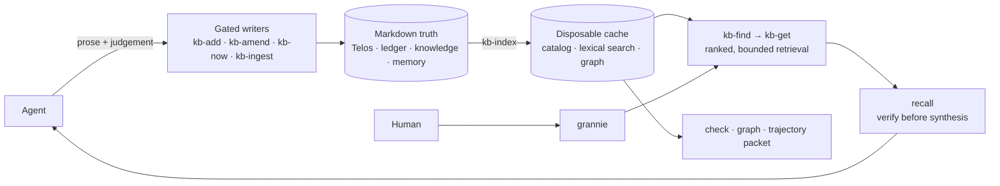

<div align="center">

# Promptus

### Research memory that survives the session.

Gated Markdown for long-running agentic work, retrieved with its confidence attached.

[](https://github.com/Gavin-Qiao/organon/actions/workflows/ci.yml)
[](https://github.com/Gavin-Qiao/organon/releases)
[](https://bun.sh)
[](../LICENSE)

[Quick start](#quick-start) · [Model](#four-stores-one-record) · [Workflows](#specialized-workflows) · [Reference](#commands-and-skills) · [Organon](../README.md)

</div>

Promptus is a project-local research knowledge system for Claude Code and Codex. It preserves the
decisions, evidence, failed routes, findings, and durable facts an agent needs to resume work without
quietly inventing its history. A person reads the store through one port: `grannie`, which explains
what the project knows in plain language and keeps its confidence matched to the record.

> [!IMPORTANT]
> Markdown is authoritative. The catalog, lexical index, graph, and health receipts are derived and
> disposable. Structured research units use gated writers; new machinery enters only after a
> measured threshold justifies it.

## Quick start

### Install

Claude Code:

```text
/plugin marketplace add Gavin-Qiao/organon
/plugin install promptus@organon
```

Codex:

```bash
codex plugin marketplace add Gavin-Qiao/organon
codex plugin add promptus@organon
```

Promptus requires [Bun](https://bun.sh) 1.3 or newer. Start a new Codex task after installation so
the new skill bundle is loaded.

### Initialize a project

In Claude Code:

```text
/promptus:promptus-init
```

In Codex, ask it to use the `promptus-init` skill. Initialization creates the four stores under
`.promptus/`, installs a portable `AGENTS.md` cadence, seeds the vocabulary, and smoke-tests
retrieval.

### Work normally

Use `research-ledger` to record decisions, results, observations, and dead ends through `kb-add`.
Use `recall` before making a claim about prior project work. Before compaction or a long handoff,
use `promptus-checkpoint`.

```text
work → store the durable result → rebuild the derived index → retrieve before claiming → checkpoint
```

The `promptus` skill is the portable map. Claude Code exposes the same map as `/promptus:help`.

## How it works



The model makes one division of labor explicit. The agent writes prose, judges relevance, and
decides what is worth keeping. Deterministic scripts own the envelope: timestamp, stable ID,
placement, controlled vocabulary, relation resolution, hashes, indexes, and health gates.

## Four stores, one record

| Store | Path | What belongs there |
| --- | --- | --- |
| **Telos** | `.promptus/TELOS.md` | Direction and invariants. It is operator-governed and intentionally has no epistemic status. |
| **Ledger** | `.promptus/ledger/RESEARCH-LEDGER.md` | The append-only Log of what happened and why, including mistakes and dead ends. Its bounded NOW header is refreshed separately through `kb-now`. |
| **Knowledge** | `.promptus/docs/` and `.promptus/docs/lit/` | Distilled findings and provenance-bearing literature units. |
| **Memory** | `.promptus/memory/` | One file per durable project fact, plus a small index. |

Retrievable units keep three facets separate:

| Facet | Question | Examples |
| --- | --- | --- |
| `kind` | What sort of act or unit is this? | `RESULT`, `DECISION`, `DEADEND`, `PAPER` |
| `status` | How strongly does the record support it? | `VALIDATED`, `CONJECTURED`, `REFUTED`, `CITE`, `validated` |
| `relation` | How does it bear on another unit? | `supports`, `refutes`, `supersedes`, `derives-from` |

A dead end is therefore not a confidence level. A ledger unit may have `kind: DEADEND` and
`status: REFUTED`; retrieval reports its substrate and effective status without erasing why it was
recorded.

## Store, book-keep, retrieve

| Operation | Deterministic surface | Agent responsibility |
| --- | --- | --- |
| **Store** | `kb-add` writes a new unit; `kb-amend` changes curated metadata; `kb-now` owns the bounded handoff header; `kb-ingest` curates or quarantines external material | Supply the prose, status, provenance, and relations that judgment requires |
| **Book-keep** | `kb-index` rebuilds catalog, lexical search, and graph; `promptus-check --strict` writes the authoritative health receipt | Resolve genuine classification or link debt rather than hiding it |
| **Retrieve** | `kb-find` ranks and caps headers; `kb-get` fetches bounded bodies; `kb-graph` navigates links | Verify each used claim at its source, then synthesize at the recorded confidence |

`kb-add` writes the source unit and updates the catalog entry needed for immediate continuity. The
authoritative `kb-index` rebuild, run directly or by a trusted hook, refreshes the complete lexical
and graph projections.

<details>
<summary><strong>Repository-root script examples</strong></summary>

These paths are for an Organon checkout. Installed skills resolve their own plugin root and should
be preferred in ordinary use.

```bash
# Store a ledger result. The script owns timestamp, ID, placement, and envelope.
printf '%s\n' 'The controlled run reproduced the result.' \
  | bun promptus/scripts/kb-add.ts \
      --substrate ledger --kind RESULT --status VALIDATED \
      --title 'Reproduce the controlled run'

# Rebuild and verify.
bun promptus/scripts/kb-index.ts
bun promptus/scripts/promptus-check.ts --strict

# Retrieve headers first, then fetch only the units that earned a read.
bun promptus/scripts/kb-find.ts 'controlled run'
bun promptus/scripts/kb-get.ts '.promptus/docs/example.md'
```

</details>

## Resume safely

> [!WARNING]
> Run `promptus-session-doctor` before trusting a long-running project's NOW header, cached search,
> graph traversal, or prior health receipt. A non-zero result is a stop signal, not permission to
> repair the store automatically.

The session doctor is strictly read-only. It compares every live Markdown unit with catalog and
search, checks cold history, detects identity collisions, validates the NOW boundary, and separates
current artifact failures from archival drift owned by superseded or retired units. It never
reindexes, refreshes, repairs, or records a debt baseline.

The authoritative whole-store gate is separate:

```bash
bun promptus/scripts/promptus-check.ts --strict
```

It verifies source and NOW freshness, stable-ID uniqueness, classification, typed relations,
declared artifacts, and governed thinker custody. `--ratchet` can enforce no new inherited debt;
`--strict-graph` requires zero dangling links and zero orphans.

## Human read-port

`grannie` is the only human-facing knowledge port.

- `/grannie explain <concept>` retrieves relevant units, verifies what it uses, and explains them
  at their recorded confidence.
- `/grannie status` reads the deterministic `promptus-status` output before translating the Telos,
  NOW, blocker, next action, and resume point.

When Editio is installed, `grannie` can use its `humanizer` style toolkit. Without Editio it still
answers plainly; knowledge behavior does not depend on the style plugin.

## Specialized workflows

<details open>
<summary><strong>Trajectory review</strong></summary>

`promptus-trajectory-review` collects a bounded, source-fingerprint-bound packet for either the
whole project or the causal closure of one exact endeavour. The `trajectory-review` skill reads the
bodies it cites and judges whether recorded work is narrowing, parking, or reopening for a reason.
It does not score research quality or change project authority. Persisting a review is a second,
operator-approved act through `kb-add`.

</details>

<details>
<summary><strong>External thinker round</strong></summary>

`thinker-round` is for one precise theoretical bottleneck. It seals a self-contained question and
refute-first checks for an operator-carried, stateless outside reasoner. The exact return is retained
and quarantined as `lit:UNTRUSTED`. Only independently checked claims may later become a normal
finding. A thinker response grants no implementation, release, or publication authority.

</details>

<details>
<summary><strong>Graph inspection</strong></summary>

`kb-graph rank` computes PageRank over active resolved page links. `lint` reports dangling handles
and relation-free or link-free orphans. `suggest` proposes related but unlinked pairs from shared
vocabulary and sources. None of these commands changes Markdown.

</details>

## Commands and skills

Claude Code exposes command adapters; Codex and Claude Code both use the portable skills.

<details>
<summary><strong>Command adapters</strong></summary>

| Command | Purpose |
| --- | --- |
| `/promptus:help` | Map the stores, verbs, and workflows |
| `/promptus:promptus-init` | Initialize a project store and agent cadence |
| `/promptus:promptus-session-doctor` | Run the read-only resume preflight |
| `/promptus:checkpoint` | Flush perishable state before compaction |
| `/promptus:promptus-doctor` | Diagnose or dry-run a layout/vocabulary migration |
| `/promptus:promptus-check` | Run the authoritative whole-store gate |
| `/promptus:promptus-ingest` | Backfill, promote, or quarantine external material |
| `/promptus:thinker-round` | Govern one operator-carried theory round |
| `/promptus:trajectory-review` | Reconstruct a bounded research trajectory |
| `/promptus:promptus-graph` | Rank, lint, or suggest graph links |

</details>

<details>
<summary><strong>Portable skills</strong></summary>

| Skill | Purpose |
| --- | --- |
| `promptus` | Orchestrator and decision map |
| `promptus-init` | Store initialization |
| `promptus-session-doctor` | Read-only resume preflight |
| `promptus-checkpoint` | Pre-compaction flush |
| `promptus-check` | Whole-store health gate |
| `promptus-doctor` | Layout and vocabulary diagnosis or migration |
| `promptus-ingest` | Provenance-preserving curation |
| `promptus-graph` | Graph workflows |
| `research-ledger` | Store-as-you-go recording discipline |
| `recall` | Claim-first retrieval and verification |
| `grannie` | Plain-language explanation and status |
| `telos` | Operator-governed direction maintenance |
| `thinker-round` | Stateless external theory custody |
| `trajectory-review` | Bounded causal retrospective |
| `grounded-writing-reviewer` | Read-only style and evidence audit |

</details>

## Optional lifecycle hooks

Trusted hooks are strict no-ops outside a repository containing `.promptus/`.

| Event | Behavior |
| --- | --- |
| Session start | Injects a bounded Telos block, then the bounded NOW handoff |
| Before tools | Blocks freehand ledger log/stamp patterns and writes to the disposable cache; it points the agent back to the appropriate gate |
| After tools | Rebuilds the index after `kb-add` |
| Handoff | Nudges a checkpoint through Claude Code `SessionEnd` or Codex `PreCompact` |

Claude Code reads [`hooks/hooks.json`](hooks/hooks.json). Codex reads
[`hooks/codex.json`](hooks/codex.json), with separate POSIX and Windows launch commands. Installing
the plugin does not silently trust executable hooks; inspect them with `/hooks` first.

## Files on disk

```text
.promptus/
├─ TELOS.md
├─ ledger/RESEARCH-LEDGER.md
├─ docs/
│  ├─ <finding>.md
│  └─ lit/<source>.md
├─ memory/
│  ├─ MEMORY.md
│  └─ <fact>.md
├─ schema/kb-vocab.json
└─ cache/                         derived and disposable
   ├─ CATALOG.md
   ├─ search.json
   ├─ graph.json
   └─ health.json
```

The plugin itself keeps scripts, skills, command adapters, hooks, and templates in separate
directories. See the validated adapter manifests for the installed surface.

## Why no database or embeddings?

At notes scale, explicit headers, status filters, and Markdown links are cheap and inspectable.
Promptus therefore ships bounded lexical retrieval and a file-derived graph, with no database,
daemon, or embedding dependency. This is a measured boundary rather than an article of faith.

Organon's [benchmark notebook](../benchmarks/README.md) records both sides of that decision. Exact
work conservation restored large-store maintenance cadence without SQLite, so SQLite remains
deferred. Local dense retrieval improved semantic recall, but a dense replacement lost lexical
controls; a lifecycle-filtered mixed candidate route remains an experiment, not a shipped feature.

## Research foundations

<details>
<summary><strong>Memory, provenance, and agent-native records</strong></summary>

The design follows converging lessons rather than a novelty claim:

- [LongMemEval](https://proceedings.iclr.cc/paper_files/paper/2025/hash/d813d324dbf0598bbdc9c8e79740ed01-Abstract-Conference.html)
  separates extraction, multi-session reasoning, temporal reasoning, updates, and abstention.
- [MemoryAgentBench](https://proceedings.iclr.cc/paper_files/paper/2026/hash/fd1eff9dd295df50a41f2521942fa31d-Abstract-Conference.html)
  evaluates retrieval, test-time learning, long-range understanding, and selective forgetting.
- [Mem2ActBench](https://aclanthology.org/2026.acl-long.370/) separates memory retrieval from
  whether remembered state changes an agent's action.
- [LightMem](https://proceedings.iclr.cc/paper_files/paper/2026/hash/a05b72653ec5b473732129829ae04195-Abstract-Conference.html)
  separates cheap foreground memory from deferred consolidation.
- [ReMemR1](https://proceedings.iclr.cc/paper_files/paper/2026/hash/7e0dc9ccba0f1333be13a3f9dc2b3138-Abstract-Conference.html)
  motivates revisitable history instead of forward-only overwrite.
- [GenProve](https://aclanthology.org/2026.acl-long.228/) distinguishes citation from the finer
  question of how evidence supports a generated claim.
- [ARA](https://arxiv.org/abs/2604.24658) uses agent-native, status-bearing research artifacts and
  preserves an exploration trace.
- Andrej Karpathy's [llm-wiki](https://gist.github.com/karpathy/442a6bf555914893e9891c11519de94f)
  is a kindred pattern: persistent, agent-maintained Markdown over raw sources.

Promptus adopts the evaluation boundaries that fit its job. It does not turn every paper into a
new required field or a reason to add heavier storage machinery.

</details>

<details>
<summary><strong>Retrieval and graph lineage</strong></summary>

[Basic Memory](https://github.com/basicmachines-co/basic-memory),
[Letta](https://github.com/letta-ai/letta), [Mem0](https://github.com/mem0ai/mem0), and
[Graphiti](https://github.com/getzep/graphiti) are close neighbors on file-based or lifecycle-aware
agent memory. [GraphRAG](https://github.com/microsoft/graphrag),
[HippoRAG 2](https://arxiv.org/abs/2502.14802), [KAG](https://arxiv.org/abs/2409.13731), and the
classical PageRank and hubness literature inform the graph experiments. Promptus keeps only the
parts justified at its present scale.

The longer prior-art synthesis lives in
[`prior-art-landscape-2026.md`](../.promptus/docs/prior-art-landscape-2026.md).

</details>

## Development

```bash
bun test
bun run validate
bun run health
```

Promptus dogfoods itself: Organon's own store is [`.promptus/`](../.promptus/). Development follows
[`AGENTS.md`](../AGENTS.md), release history lives in [`CHANGELOG.md`](CHANGELOG.md), and per-plugin
release mechanics live in [`RELEASING.md`](../RELEASING.md).

## License

Promptus is GPL-3.0-only, © 2026 Mohan Qiao. See [`LICENSE`](../LICENSE).
